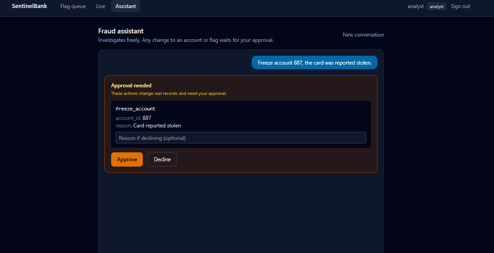
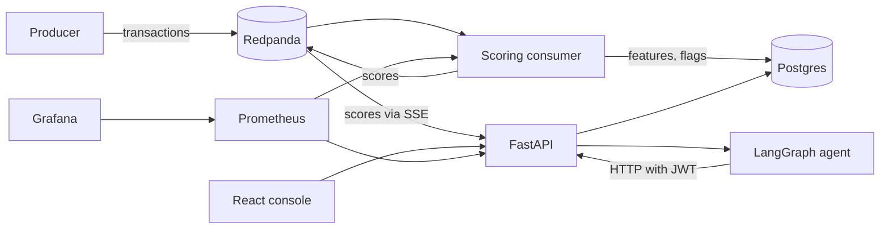
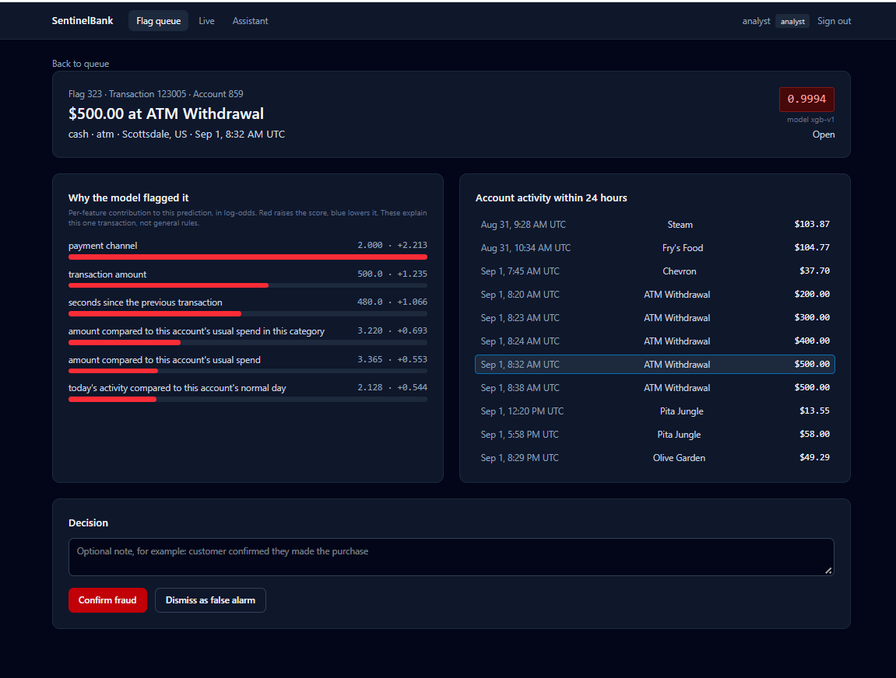
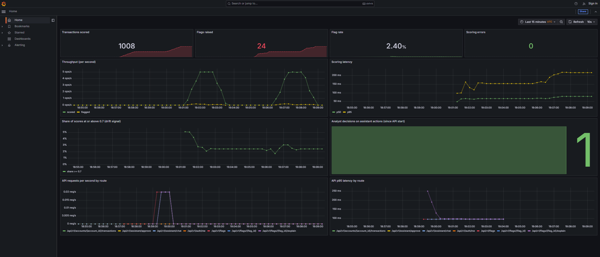
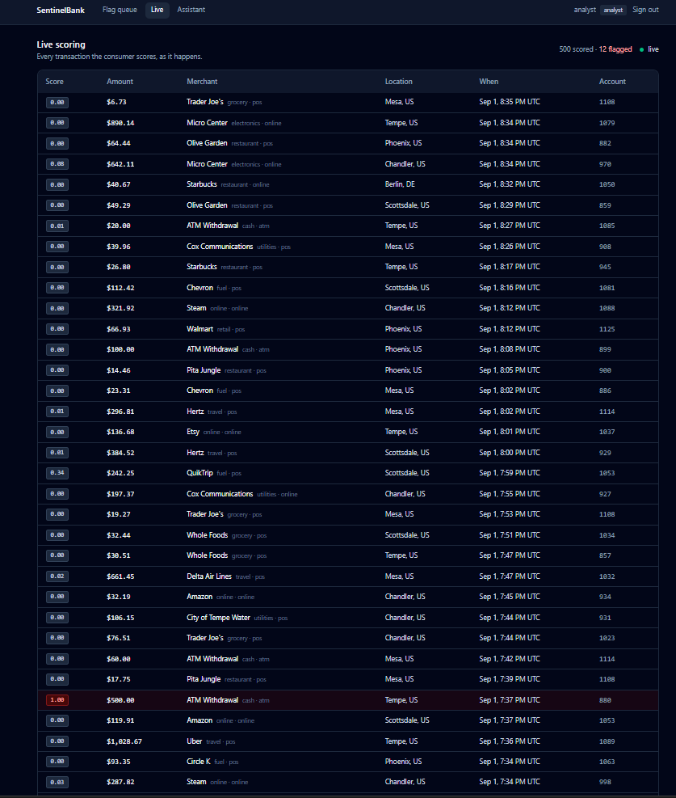

# SentinelBank

Real-time fraud detection on banking transactions, with an AI assistant that investigates flags and proposes actions, but cannot change a record until a human approves.



## What it does

1. A producer streams transactions into Redpanda (Kafka API).
2. A consumer computes 20 features per transaction from Postgres, scores it with an XGBoost model, writes a fraud flag when the score reaches 0.7, and publishes every score to a second topic.
3. A FastAPI service exposes accounts, transactions, and flags behind JWT auth with analyst and viewer roles.
4. A LangGraph agent answers questions about flags using the same API. It can look anything up freely. Freezing an account or closing a flag pauses the graph and waits for an analyst to approve or decline.
5. A React console shows the flag queue, a per-flag explanation built from SHAP values, a live score feed, and the assistant.
6. Prometheus and Grafana track throughput, scoring latency, flag rate, score drift, and analyst decisions.

## Architecture



The agent runs inside the API process but calls the API over HTTP like any other client. It never gets a database session, so every action it takes goes through the same auth, validation, and conflict rules as a human using the console.

## Results

All numbers below come from runs in this repository with the default seed. The full report is in [docs/evaluation.md](docs/evaluation.md) and the model card is in [docs/model-card.md](docs/model-card.md).

The data is synthetic and the fraud patterns were designed here, so these numbers show that the pipeline works end to end, not that the model would catch real fraud at this rate.

**Data.** 32,624 transactions across 200 customers and 282 accounts over 60 days, with 638 labeled fraud (1.96%) from five patterns.

**Split.** By time, not randomly. The first 45 days train (23,958 rows), the last 15 days test (8,666 rows, 176 fraud).

**Model.** On the held-out final 15 days:

| Model | PR-AUC | ROC-AUC | Precision | Recall |
|---|---|---|---|---|
| Isolation Forest (unsupervised baseline) | 0.2587 | 0.8414 | 0.42 | 0.22 |
| XGBoost (weighted, 20 features) | 0.8259 | 0.9882 | 0.78 | 0.75 |

PR-AUC is the headline metric because with 2% fraud, a model that flags nothing still scores 98% accuracy.

At the best-F1 threshold of 0.7, XGBoost catches 132 of 176 fraud transactions and 132 of its 170 flags are real fraud, with 38 false positives out of 8,490 normal transactions.

| Fraud pattern | Test rows | Caught | Recall |
|---|---|---|---|
| Card testing | 52 | 48 | 92% |
| Night high value | 27 | 24 | 89% |
| ATM drain | 30 | 25 | 83% |
| Impossible travel | 28 | 22 | 79% |
| Subtle account takeover | 39 | 13 | 33% |

**Serving.** Measured with Prometheus over 500-transaction runs at 5 per second on a laptop, scoring one transaction (feature query, prediction, and flag write) took 40 to 60 ms at the median and 80 to 200 ms at p95, depending on what else was running on the machine. The SHAP explanation endpoint is the slowest API route at about 250 to 400 ms p95, since it recomputes features and contributions on every request.

**Tests.** 70 tests. 69 run in CI with no API key. One opt-in test calls the real LLM.

## How the model got here

The first model scored 0.9988 PR-AUC and caught every fraud transaction in the test set. That was a problem with the data, not a win. The first generator made fraud that looked nothing like normal spending, so a single velocity feature almost solved it.

The generator was rewritten so normal behavior overlaps with every fraud pattern: each customer has their own favorite categories and spending level, some shop in bursts, some travel abroad, some shop at night, and anyone can make an occasional large purchase. A fifth pattern, subtle account takeover, was added to look as normal as possible.

On the new data the model dropped to 0.7724 PR-AUC, with subtle takeover recall at 6 of 39. Two rounds of account-relative features followed. The first round barely moved it. The second, which added the share of an account's past spending in the category and the amount compared to that account's usual spend in that category, reached 0.8259 and raised subtle takeover to 13 of 39.

The unsupervised baseline tells the same story from the other side: Isolation Forest scored 0.46 PR-AUC on the easy first dataset and only 0.26 on the harder one, because the fraud is no longer extreme enough to isolate without labels.

## Known limitation

Subtle takeover recall is 33%. These transactions happen at a normal time, in the customer's home city, in a category they sometimes use, for two to four times their usual amount. Nothing in the available data marks them as unusual. Catching more would need signals this data does not have, such as device fingerprint, IP address, new-device logins, or merchant risk. Adding fake versions of those to the generator would mean inventing the clue that makes the fraud catchable, so it stays documented as a gap.

The Grafana drift panel is where this would be watched in production.

## Human approval



The agent is a LangGraph state machine with three nodes: model, approval gate, and tools. Read tools run without asking. Before `freeze_account`, `unfreeze_account`, or `review_flag` runs, the graph calls `interrupt()`, saves its state to Postgres, and returns the exact tool name and arguments to the analyst.

- A declined action returns a message to the model saying it was not approved and must not be retried.
- A missing or mismatched decision counts as declined.
- A viewer cannot approve, and the role is checked in the API endpoint, the graph, and the approval handler.
- Conversations are tied to the user who started them.
- Tool results are treated as data, never instructions, in case a merchant name contains text aimed at the model.

The approval tests use a scripted fake model, so they run in CI without an API key and assert that no tool executed, not just that the reply says so.

## Keeping training and serving in sync

The batch feature builder uses pandas. The consumer computes the same 20 features for one transaction with a single SQL query. A test writes transactions to Postgres, runs both paths, and asserts every feature matches on every row, so a change to one implementation without the other fails CI.

## Monitoring



The Grafana dashboard is provisioned from files, so it appears on `docker compose up` with no setup. It shows transactions scored, flags raised, flag rate, scoring errors, throughput, p50 and p95 scoring latency, the share of scores at or above the flag threshold as a drift signal, analyst decisions on assistant actions, and API traffic and latency by route.



## Tech stack

| Layer | Choice | Why |
|---|---|---|
| Database | Postgres 16, SQLAlchemy 2.0, Alembic | Relational banking data, exact decimals for money, versioned migrations |
| Streaming | Redpanda | Kafka API in one container with no ZooKeeper |
| Model | XGBoost, scikit-learn, MLflow | Strong on imbalanced tabular data, runs tracked locally |
| Explanations | XGBoost SHAP contributions | The model's own per-prediction arithmetic |
| API | FastAPI, Pydantic v2, JWT | Typed, async-capable, automatic OpenAPI docs |
| Agent | LangGraph, Groq (`openai/gpt-oss-120b`) | Explicit state graph with interrupts, free inference tier |
| Frontend | React, TypeScript, Vite, Tailwind | Typed against the API, served by nginx in production |
| Ops | Docker Compose, GitHub Actions, Prometheus, Grafana | Everything local or free tier |

The LLM provider is one setting. `LLM_PROVIDER=ollama` runs the agent fully offline.

## Run it

You need Docker, [uv](https://docs.astral.sh/uv/), and Node 22. A free Groq API key from https://console.groq.com is needed for the assistant only.

```bash
git clone https://github.com/mounikagajja/sentinelbank.git
cd sentinelbank
cp .env.example .env
```

On Windows use `Copy-Item .env.example .env`. Then edit `.env`: set `POSTGRES_PASSWORD`, `JWT_SECRET` (any long random string), and `GROQ_API_KEY`.

Train the model once:

```bash
uv sync --all-groups
docker compose up -d postgres redpanda
uv run alembic upgrade head
uv run python -m data.generator.generate --reset
uv run python -m ml.features.build
uv run python -m ml.training.train
uv run python -m ml.evaluation.report
```

Start everything and stream some transactions:

```bash
docker compose up -d --build
docker compose --profile demo up producer
```

| Service | Address |
|---|---|
| Console | http://localhost:8080 |
| API docs | http://localhost:8000/docs |
| Grafana | http://localhost:3000 |
| Prometheus | http://localhost:9090 |

Demo accounts: `analyst` / `analyst123` can review and act. `viewer` / `viewer123` is read only.

## Tests and CI

```bash
uv run pytest -m "not live"
```

On every push, GitHub Actions starts Postgres, runs migrations, generates data, trains a model from scratch, runs the tests, lints and builds the frontend, and builds both Docker images. A clean machine with nothing from a laptop has to reproduce the whole pipeline for CI to pass.

## Project layout

```
backend/     FastAPI app, models, schemas, auth, SHAP explanation service
ml/          feature builder (batch and online), training, evaluation
streaming/   producer and scoring consumer
assistant/   LangGraph agent, prompts, tools
data/        synthetic generator
frontend/    React console
infra/       Prometheus and Grafana config
docs/        evaluation report and model card
```

## Shortcuts taken on purpose

- Demo users are hardcoded, with bcrypt-hashed passwords. A real system would have a users table.
- The frontend keeps the token in localStorage. A bank would use an httpOnly cookie.
- The live feed passes the token in the query string because the browser's EventSource cannot set headers.
- The explanation endpoint recomputes features on each request instead of reading stored ones.
- Migrations run when the API starts, which is fine for one instance but not for several.